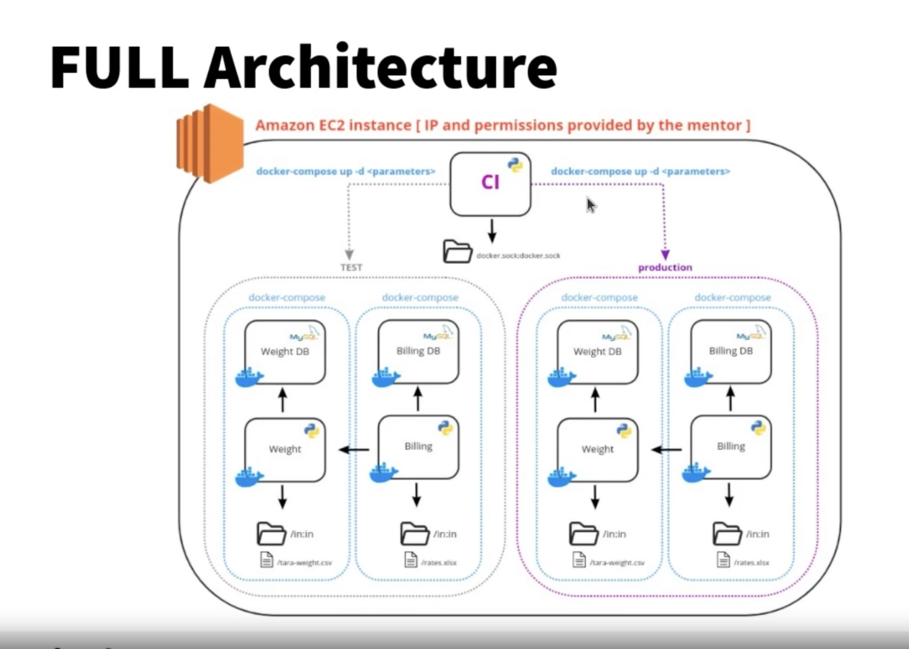

Here’s a clean and professional version of what to put in your GitHub repository's README file:

---

# **Gan Shmuel Project**

Welcome to **Gan Shmuel** – a robust and scalable system designed to manage critical operations like truck weighing, provider billing, and continuous integration for agricultural workflows.

---


---

## **Project Overview**

The **Gan Shmuel System** consists of three main microservices that work together to streamline agricultural and industrial processes:

1. **Weight Microservice**:  
   Manages truck and container weighing operations, ensuring accurate tracking and net weight calculations.

2. **Billing Microservice**:  
   Handles provider registration, rate management, and automated payment calculations based on recorded weights.

3. **DevOps CI Service**:  
   Automates the CI/CD pipeline for seamless code building, testing, and deployment.

---

## **Architecture Overview**



---

## **Key Features**

### **Weight Microservice**
- Track truck and container weights.
- Calculate `Bruto`, `Neto`, and `Tara`.
- Upload batch weights from a file.
- Retrieve unknown weights or specific sessions.

### **Billing Microservice**
- Register providers and trucks.
- Upload and manage product rates.
- Generate detailed billing reports by provider.

### **DevOps CI Service**
- Trigger CI workflows automatically.
- Monitor service health.
- Integrate with GitHub webhooks.

---

## **Getting Started**

### **1. Clone the Repository**

```bash
git clone https://github.com/your-username/gan-shmuel.git
cd gan-shmuel
```

### **2. Start the Services**

Using Docker Compose:
```bash
docker-compose up
```

### **3. Access Services**
- **Weight Service**: `http://localhost:<port>`
- **Billing Service**: `http://localhost:<port>`
- **DevOps Service**: `http://localhost:<port>`

---

## **API Documentation**

### Example: **Weight Microservice**
#### POST `/weight`
Records the weight of a truck or container.  
**Parameters:**
- `direction`: `in`, `out`, or `none`.
- `truck`: Truck license plate or `"na"`.
- `weight`: Integer value.
- `unit`: `kg` or `lbs`.
- `produce`: Type of produce, e.g., `"orange"`.
- `force`: Boolean to handle errors.

For full API details, [click here](API_DOCUMENTATION.md).

---

## **Directory Structure**

```plaintext
gan-shmuel/
├── weight/
│   ├── api/
│   └── tests/
├── billing/
│   ├── api/
│   └── data/
├── devops/
│   ├── scripts/
│   └── ci_pipeline.py
└── README.md
```

---

## **Health Checks**

Each service includes a `/health` endpoint to verify system status:
- **Response (200 OK)**: Service is operational.
- **Response (500 Error)**: Dependent resource unavailable.

---

## **Contributing**

Contributions are welcome! Please follow the guidelines below:
1. Fork the repository.
2. Create a new branch: `git checkout -b feature/your-feature`.
3. Commit changes: `git commit -m 'Add new feature'`.
4. Push your branch: `git push origin feature/your-feature`.
5. Submit a pull request.

---

Feel free to customize further as per your team's preferences!